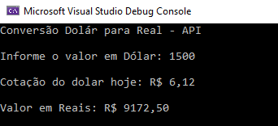

# Conversão Dólar para Real - API 🌎💵➡️🇧🇷

Este é um projeto simples em C# que realiza a conversão de valores em dólares (USD) para reais (BRL) com base na cotação atual obtida via API.

## 🚀 Funcionalidades

- Conversão de valores de dólar para real.
- Cotação do dólar em tempo real usando [AwesomeAPI](https://docs.awesomeapi.com.br/api-de-moedas).
- Tratamento de erros para entradas inválidas ou problemas com a API.

## 🛠️ Tecnologias Utilizadas

- Linguagem: **C#**
- API: **[AwesomeAPI](https://economia.awesomeapi.com.br/json/last/USD-BRL)**
- Biblioteca: **[Newtonsoft.Json](https://www.newtonsoft.com/json)** para manipulação de JSON.

## 📋 Como Funciona

1. O usuário informa o valor em dólares.
2. O programa consulta a cotação atual do dólar utilizando a API.
3. A conversão é calculada e exibida no console.

## ⚙️ Pré-requisitos

- [.NET SDK](https://dotnet.microsoft.com/download) instalado no computador.

## 🖥️ Como Executar

1. Clone este repositório:
   ```bash
   git clone https://github.com/seu-usuario/conversao-dolar-real.git

2. Navegue até o diretório do projeto:
   ```bash
    cd conversao-dolar-real
   
3. Compile e execute o programa:
   ```bash
    dotnet run
   
📌 Exemplo de Uso
Entrada:
Informe o valor em Dólar: 100

Saída:
Cotação do dólar hoje: R$ 6,10
Valor em Reais: R$ 610,00



## 🛡️ Tratamento de Erros
Verificação de entrada inválida para valores numéricos.
Mensagem amigável caso a API não esteja disponível.

## 📚 Aprendizados
Consumo de APIs REST em C#.
Manipulação de JSON com Newtonsoft.Json.
Boas práticas de tratamento de exceções em aplicações de console.

## 🤝 Contribuições
Contribuições são sempre bem-vindas! Sinta-se à vontade para abrir uma issue ou enviar um pull request.

## 📜 Licença
Este projeto está licenciado sob a MIT License.

Feito por Guilherme Bomfim
